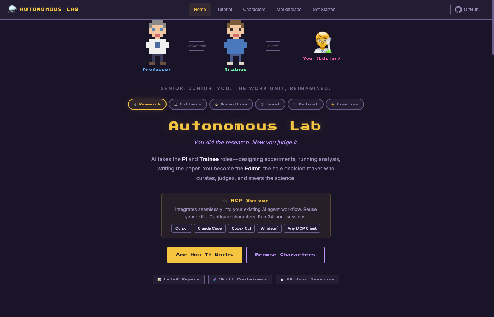
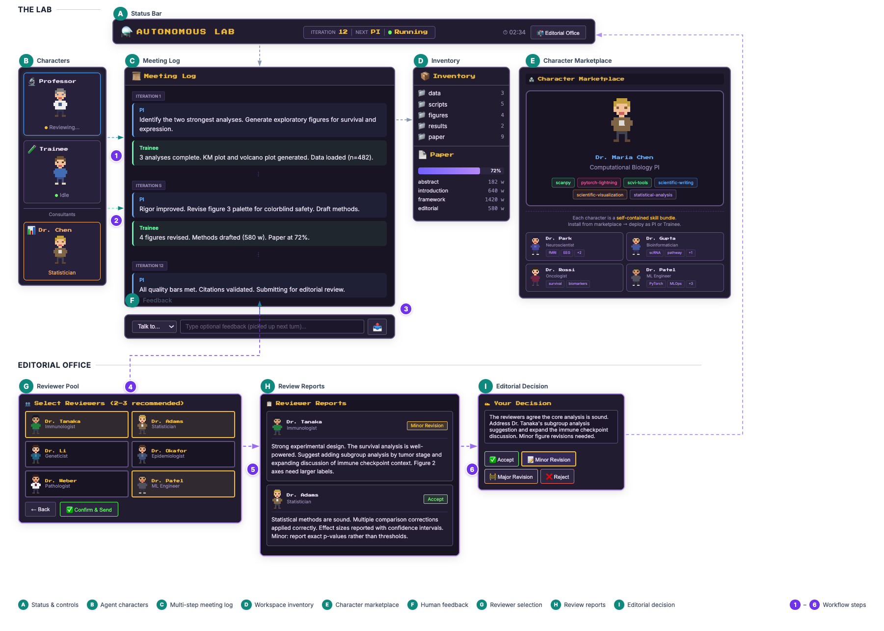

# Autonomous Lab

[](https://autolab.kejunying.com)
[](https://pypi.org/project/autonomous-lab/)
[](LICENSE)

MCP server that turns any senior-junior workflow into an autonomous loop. AI handles the execution. You make the decisions.

<p align="center">
  <a href="https://autolab.kejunying.com">
    
  </a>
</p>

## Vision

The bottleneck in knowledge work has never been execution. It is judgment -- knowing which questions matter, which results are meaningful, which directions to pursue. The people best equipped to make those calls spend most of their time on tasks that don't require their specific expertise.

Autonomous Lab shifts the hierarchy up by one level. AI agents assume the working roles -- principal investigator and trainee, tech lead and developer, attending and resident -- running the full design-execute-review loop. The human moves into the editorial position: the one who curates, judges, and steers. Your taste and judgment, rather than your labor, become the primary input.

This is not a copilot. It is a reorganization of the work unit itself.

## Why this exists

Autonomous Lab is an MCP server. It runs inside the coding agent you already pay for -- Cursor, Claude Code, Windsurf, Codex CLI, or any MCP-compatible client. That means:

- **No API key required.** You don't need an OpenAI/Anthropic/Google key. The intelligence comes from whichever model your coding tool already uses.
- **No extra cost.** Your existing Cursor Pro, Claude Max, Windsurf, or Codex subscription is all you need. You are reusing an investment you have already made.
- **No new app to learn.** It plugs into your current workflow as a set of MCP tools.

## Install

The easiest way: copy this page link into **Claude Code**, Cursor, or any coding agent and ask it to install Autonomous Lab for you. It will handle everything.

Or do it manually:

Add to your MCP client config (e.g. Cursor `~/.cursor/mcp.json`):

```json
{
  "mcpServers": {
    "autonomous-lab": {
      "command": "uvx",
      "args": ["autonomous-lab"],
      "timeout": 600,
      "env": {
        "MCP_WEB_PORT": "8766"
      }
    }
  }
}
```

Or if you installed via `uv pip install`:

```json
{
  "mcpServers": {
    "autonomous-lab": {
      "command": "autonomous-lab",
      "timeout": 600,
      "env": {
        "MCP_WEB_PORT": "8766"
      }
    }
  }
}
```

Then tell your agent: "Initialize an autonomous lab project on [your topic]."

## What it does

Two AI personas (senior + junior) iterate on your project in a loop. They design, execute, write, and revise. You sit above them as the decision maker: editor, code reviewer, creative director, or whatever the domain calls for.

The loop:

```
autolab_next → (AI acts as role) → autolab_record → lab_meeting → autolab_next → ...
```

When work is ready, you review it. Accept, request revisions, or reject. The loop continues until you're satisfied.

<p align="center">
  
</p>

<p align="center"><em>Anatomy of the monitoring interface and editorial workflow. Top: the research loop (characters, meeting log, inventory, marketplace). Bottom: the editorial office (reviewer selection, reports, decision).</em></p>

## Key capabilities

- **Zero additional cost**: runs on your existing coding agent subscription. No separate API keys, no usage-based billing, no new accounts.
- **Skill containers**: configure characters with any combination of SKILL.md files you already have. A PI with `scanpy + scientific-writing + statistical-analysis` skills behaves differently from a Tech Lead with `react + typescript + code-review` skills.
- **24-hour sessions**: the loop runs indefinitely. No timeout, no context loss. Sessions persist across disconnects with `autolab_resume`.
- **Fully configurable**: YAML character profiles control personality, expertise, goals, and available tools. Swap them in seconds.
- **Domain-agnostic**: research, software, consulting, legal, medical, creative, or anything with a senior-junior structure.
- **Expert consultation**: invite domain specialists mid-session for one-off advice without breaking the loop.
- **Verified citations**: built-in CrossRef integration for real, validated references (no hallucinated papers).
- **Game-style monitoring UI**: browser dashboard shows live progress, iteration history, and editorial controls.

## MCP tools

| Tool | What it does |
|------|-------------|
| `autolab_init` | Initialize a new project |
| `autolab_resume` | Resume an interrupted session |
| `autolab_next` | Get the next role prompt (PI or Trainee) |
| `autolab_record` | Record a completed turn |
| `autolab_status` | Check project state |
| `autolab_cite` | Search, validate, and format citations |
| `autolab_consult` | Invite a domain expert |
| `autolab_editorial` | Wait for editor decision |
| `autolab_editor_act` | Execute editorial decision (AI fallback) |
| `autolab_create_character` | Build a character profile |
| `lab_meeting` | Pause for user feedback between turns |

## Character example

```yaml
name: Dr. Maria Chen
role: pi
title: Computational Biology PI
expertise: single-cell genomics, machine learning
goal: discover cell-type-specific regulatory programs
skills:
  - scanpy
  - scvi-tools
  - scientific-writing
  - statistical-analysis
personality:
  - "Visionary: spots novel research directions"
  - "Rigorous: demands statistical reproducibility"
```

## Requirements

- Python >= 3.11
- An MCP-compatible client (Cursor, Claude Code, Codex CLI, Windsurf, etc.)

## Acknowledgments

Autonomous Lab builds on these open-source projects:

- [The Virtual Lab](https://github.com/zou-group/virtual-lab) by James Zou Lab, Stanford (MIT) -- the concept of LLM agents as PI and scientists iterating through structured research meetings ([Swanson et al., Nature 2025](https://www.nature.com/articles/s41586-025-09442-9))
- [mcp-feedback-enhanced](https://github.com/Minidoracat/mcp-feedback-enhanced) by Minidoracat (MIT) -- Web UI, feedback loop, session management, and i18n infrastructure
- [interactive-feedback-mcp](https://github.com/fabiomlferreira/interactive-feedback-mcp) by Fábio Ferreira (MIT) -- the original MCP feedback server
- [biomni](https://github.com/snap-stanford/Biomni) by Jure Leskovec Lab, Stanford (Apache 2.0) -- optional biomedical toolkit integration

## License

Apache 2.0. See [LICENSE](LICENSE) and [NOTICE](NOTICE).
